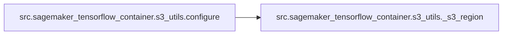

# Src Sagemaker Tensorflow Container S3 Utils

[_Documentation generated by Documatic_](https://www.documatic.com)

<!---Documatic-section-Codebase Structure-start--->
## Codebase Structure

<!---Documatic-block-system_architecture-start--->
```mermaid
None
```
<!---Documatic-block-system_architecture-end--->

# #
<!---Documatic-section-Codebase Structure-end--->

<!---Documatic-section-src.sagemaker_tensorflow_container.s3_utils.configure-start--->
## src.sagemaker_tensorflow_container.s3_utils.configure

<!---Documatic-section-configure-start--->


### Object Calls

* src.sagemaker_tensorflow_container.s3_utils._s3_region

<!---Documatic-block-src.sagemaker_tensorflow_container.s3_utils.configure-start--->
<details>
	<summary><code>src.sagemaker_tensorflow_container.s3_utils.configure</code> code snippet</summary>

```python
def configure(model_dir, job_region):
    os.environ['S3_REGION'] = _s3_region(job_region, model_dir)
    os.environ['TF_CPP_MIN_LOG_LEVEL'] = '1'
    os.environ['S3_USE_HTTPS'] = '1'
```
</details>
<!---Documatic-block-src.sagemaker_tensorflow_container.s3_utils.configure-end--->
<!---Documatic-section-configure-end--->

# #
<!---Documatic-section-src.sagemaker_tensorflow_container.s3_utils.configure-end--->

<!---Documatic-section-src.sagemaker_tensorflow_container.s3_utils._s3_region-start--->
## src.sagemaker_tensorflow_container.s3_utils._s3_region

<!---Documatic-section-_s3_region-start--->
<!---Documatic-block-src.sagemaker_tensorflow_container.s3_utils._s3_region-start--->
<details>
	<summary><code>src.sagemaker_tensorflow_container.s3_utils._s3_region</code> code snippet</summary>

```python
def _s3_region(job_region, model_dir):
    if model_dir and model_dir.startswith('s3://'):
        s3 = boto3.client('s3', region_name=job_region)
        parsed_url = urlparse(model_dir)
        bucket_name = parsed_url.netloc
        bucket_location = s3.get_bucket_location(Bucket=bucket_name)['LocationConstraint']
        return bucket_location or job_region
    else:
        return job_region
```
</details>
<!---Documatic-block-src.sagemaker_tensorflow_container.s3_utils._s3_region-end--->
<!---Documatic-section-_s3_region-end--->

# #
<!---Documatic-section-src.sagemaker_tensorflow_container.s3_utils._s3_region-end--->

[_Documentation generated by Documatic_](https://www.documatic.com)