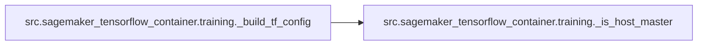
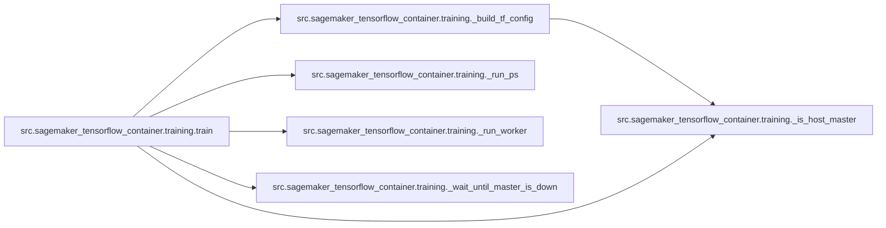
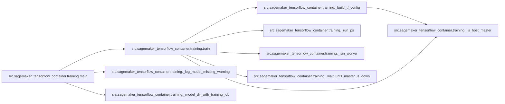

# Src Sagemaker Tensorflow Container Training

[_Documentation generated by Documatic_](https://www.documatic.com)

<!---Documatic-section-Codebase Structure-start--->
## Codebase Structure

<!---Documatic-block-system_architecture-start--->
```mermaid
None
```
<!---Documatic-block-system_architecture-end--->

# #
<!---Documatic-section-Codebase Structure-end--->

<!---Documatic-section-src.sagemaker_tensorflow_container.training._is_host_master-start--->
## src.sagemaker_tensorflow_container.training._is_host_master

<!---Documatic-section-_is_host_master-start--->
<!---Documatic-block-src.sagemaker_tensorflow_container.training._is_host_master-start--->
<details>
	<summary><code>src.sagemaker_tensorflow_container.training._is_host_master</code> code snippet</summary>

```python
def _is_host_master(hosts, current_host):
    return current_host == hosts[0]
```
</details>
<!---Documatic-block-src.sagemaker_tensorflow_container.training._is_host_master-end--->
<!---Documatic-section-_is_host_master-end--->

# #
<!---Documatic-section-src.sagemaker_tensorflow_container.training._is_host_master-end--->

<!---Documatic-section-src.sagemaker_tensorflow_container.training._build_tf_config-start--->
## src.sagemaker_tensorflow_container.training._build_tf_config

<!---Documatic-section-_build_tf_config-start--->


### Object Calls

* src.sagemaker_tensorflow_container.training._is_host_master

<!---Documatic-block-src.sagemaker_tensorflow_container.training._build_tf_config-start--->
<details>
	<summary><code>src.sagemaker_tensorflow_container.training._build_tf_config</code> code snippet</summary>

```python
def _build_tf_config(hosts, current_host, ps_task=False):
    masters = hosts[:1]
    workers = hosts[1:]
    ps = hosts if len(hosts) > 1 else None

    def host_addresses(hosts, port=2222):
        return ['{}:{}'.format(host, port) for host in hosts]
    tf_config = {'cluster': {'master': host_addresses(masters)}, 'environment': 'cloud'}
    if ps:
        tf_config['cluster']['ps'] = host_addresses(ps, port='2223')
    if workers:
        tf_config['cluster']['worker'] = host_addresses(workers)
    if ps_task:
        if ps is None:
            raise ValueError('Cannot have a ps task if there are no parameter servers in the cluster')
        task_type = 'ps'
        task_index = ps.index(current_host)
    elif _is_host_master(hosts, current_host):
        task_type = 'master'
        task_index = 0
    else:
        task_type = 'worker'
        task_index = workers.index(current_host)
    tf_config['task'] = {'index': task_index, 'type': task_type}
    return tf_config
```
</details>
<!---Documatic-block-src.sagemaker_tensorflow_container.training._build_tf_config-end--->
<!---Documatic-section-_build_tf_config-end--->

# #
<!---Documatic-section-src.sagemaker_tensorflow_container.training._build_tf_config-end--->

<!---Documatic-section-src.sagemaker_tensorflow_container.training._run_ps-start--->
## src.sagemaker_tensorflow_container.training._run_ps

<!---Documatic-section-_run_ps-start--->
<!---Documatic-block-src.sagemaker_tensorflow_container.training._run_ps-start--->
<details>
	<summary><code>src.sagemaker_tensorflow_container.training._run_ps</code> code snippet</summary>

```python
def _run_ps(env, cluster):
    logger.info('Running distributed training job with parameter servers')
    cluster_spec = tf.train.ClusterSpec(cluster)
    task_index = env.hosts.index(env.current_host)
    no_gpu_config = tf.ConfigProto(device_count={'GPU': 0})
    server = tf.train.Server(cluster_spec, job_name='ps', task_index=task_index, config=no_gpu_config)
    multiprocessing.Process(target=lambda : server.join()).start()
```
</details>
<!---Documatic-block-src.sagemaker_tensorflow_container.training._run_ps-end--->
<!---Documatic-section-_run_ps-end--->

# #
<!---Documatic-section-src.sagemaker_tensorflow_container.training._run_ps-end--->

<!---Documatic-section-src.sagemaker_tensorflow_container.training._run_worker-start--->
## src.sagemaker_tensorflow_container.training._run_worker

<!---Documatic-section-_run_worker-start--->
<!---Documatic-block-src.sagemaker_tensorflow_container.training._run_worker-start--->
<details>
	<summary><code>src.sagemaker_tensorflow_container.training._run_worker</code> code snippet</summary>

```python
def _run_worker(env, cmd_args, tf_config):
    env_vars = env.to_env_vars()
    env_vars['TF_CONFIG'] = json.dumps(tf_config)
    entry_point.run(uri=env.module_dir, user_entry_point=env.user_entry_point, args=cmd_args, env_vars=env_vars, capture_error=True)
```
</details>
<!---Documatic-block-src.sagemaker_tensorflow_container.training._run_worker-end--->
<!---Documatic-section-_run_worker-end--->

# #
<!---Documatic-section-src.sagemaker_tensorflow_container.training._run_worker-end--->

<!---Documatic-section-src.sagemaker_tensorflow_container.training._wait_until_master_is_down-start--->
## src.sagemaker_tensorflow_container.training._wait_until_master_is_down

<!---Documatic-section-_wait_until_master_is_down-start--->
<!---Documatic-block-src.sagemaker_tensorflow_container.training._wait_until_master_is_down-start--->
<details>
	<summary><code>src.sagemaker_tensorflow_container.training._wait_until_master_is_down</code> code snippet</summary>

```python
def _wait_until_master_is_down(master):
    while True:
        try:
            subprocess.check_call(['curl', '{}:2222'.format(master)], stdout=subprocess.PIPE, stderr=subprocess.PIPE)
            logger.info('master {} is still up, waiting for it to exit'.format(master))
            time.sleep(10)
        except subprocess.CalledProcessError:
            logger.info('master {} is down, stopping parameter server'.format(master))
            return
```
</details>
<!---Documatic-block-src.sagemaker_tensorflow_container.training._wait_until_master_is_down-end--->
<!---Documatic-section-_wait_until_master_is_down-end--->

# #
<!---Documatic-section-src.sagemaker_tensorflow_container.training._wait_until_master_is_down-end--->

<!---Documatic-section-src.sagemaker_tensorflow_container.training.train-start--->
## src.sagemaker_tensorflow_container.training.train

<!---Documatic-section-train-start--->


### Object Calls

* src.sagemaker_tensorflow_container.training._build_tf_config
* src.sagemaker_tensorflow_container.training._run_ps
* src.sagemaker_tensorflow_container.training._run_worker
* src.sagemaker_tensorflow_container.training._is_host_master
* src.sagemaker_tensorflow_container.training._wait_until_master_is_down

<!---Documatic-block-src.sagemaker_tensorflow_container.training.train-start--->
<details>
	<summary><code>src.sagemaker_tensorflow_container.training.train</code> code snippet</summary>

```python
def train(env, cmd_args):
    parameter_server_enabled = env.additional_framework_parameters.get(SAGEMAKER_PARAMETER_SERVER_ENABLED, False)
    if len(env.hosts) > 1 and parameter_server_enabled:
        tf_config = _build_tf_config(hosts=env.hosts, current_host=env.current_host)
        logger.info('Running distributed training job with parameter servers')
        logger.info('Launching parameter server process')
        _run_ps(env, tf_config['cluster'])
        logger.info('Launching worker process')
        _run_worker(env, cmd_args, tf_config)
        if not _is_host_master(env.hosts, env.current_host):
            _wait_until_master_is_down(env.hosts[0])
    else:
        mpi_enabled = env.additional_framework_parameters.get('sagemaker_mpi_enabled')
        if mpi_enabled:
            runner_type = runner.MPIRunnerType
        else:
            runner_type = runner.ProcessRunnerType
        entry_point.run(uri=env.module_dir, user_entry_point=env.user_entry_point, args=cmd_args, env_vars=env.to_env_vars(), capture_error=True, runner_type=runner_type)
```
</details>
<!---Documatic-block-src.sagemaker_tensorflow_container.training.train-end--->
<!---Documatic-section-train-end--->

# #
<!---Documatic-section-src.sagemaker_tensorflow_container.training.train-end--->

<!---Documatic-section-src.sagemaker_tensorflow_container.training._log_model_missing_warning-start--->
## src.sagemaker_tensorflow_container.training._log_model_missing_warning

<!---Documatic-section-_log_model_missing_warning-start--->
<!---Documatic-block-src.sagemaker_tensorflow_container.training._log_model_missing_warning-start--->
<details>
	<summary><code>src.sagemaker_tensorflow_container.training._log_model_missing_warning</code> code snippet</summary>

```python
def _log_model_missing_warning(model_dir):
    pb_file_exists = False
    file_exists = False
    for (dirpath, dirnames, filenames) in os.walk(model_dir):
        if filenames:
            file_exists = True
        for f in filenames:
            if 'saved_model.pb' in f or 'saved_model.pbtxt' in f:
                pb_file_exists = True
                (path, direct_parent_dir) = os.path.split(dirpath)
                if not str.isdigit(direct_parent_dir):
                    logger.warn('Your model will NOT be servable with SageMaker TensorFlow Serving containers. The SavedModel bundle is under directory "{}", not a numeric name.'.format(direct_parent_dir))
    if not file_exists:
        logger.warn('No model artifact is saved under path {}. Your training job will not save any model files to S3.\nFor details of how to construct your training script see:\nhttps://sagemaker.readthedocs.io/en/stable/using_tf.html#adapting-your-local-tensorflow-script'.format(model_dir))
    elif not pb_file_exists:
        logger.warn('Your model will NOT be servable with SageMaker TensorFlow Serving container. The model artifact was not saved in the TensorFlow SavedModel directory structure:\nhttps://www.tensorflow.org/guide/saved_model#structure_of_a_savedmodel_directory')
```
</details>
<!---Documatic-block-src.sagemaker_tensorflow_container.training._log_model_missing_warning-end--->
<!---Documatic-section-_log_model_missing_warning-end--->

# #
<!---Documatic-section-src.sagemaker_tensorflow_container.training._log_model_missing_warning-end--->

<!---Documatic-section-src.sagemaker_tensorflow_container.training._model_dir_with_training_job-start--->
## src.sagemaker_tensorflow_container.training._model_dir_with_training_job

<!---Documatic-section-_model_dir_with_training_job-start--->
<!---Documatic-block-src.sagemaker_tensorflow_container.training._model_dir_with_training_job-start--->
<details>
	<summary><code>src.sagemaker_tensorflow_container.training._model_dir_with_training_job</code> code snippet</summary>

```python
def _model_dir_with_training_job(model_dir, job_name):
    if model_dir and model_dir.startswith('/opt/ml'):
        return model_dir
    else:
        return '{}/{}/model'.format(model_dir, job_name)
```
</details>
<!---Documatic-block-src.sagemaker_tensorflow_container.training._model_dir_with_training_job-end--->
<!---Documatic-section-_model_dir_with_training_job-end--->

# #
<!---Documatic-section-src.sagemaker_tensorflow_container.training._model_dir_with_training_job-end--->

<!---Documatic-section-src.sagemaker_tensorflow_container.training.main-start--->
## src.sagemaker_tensorflow_container.training.main

<!---Documatic-section-main-start--->


### Object Calls

* src.sagemaker_tensorflow_container.training.train
* src.sagemaker_tensorflow_container.training._log_model_missing_warning
* src.sagemaker_tensorflow_container.training._model_dir_with_training_job

<!---Documatic-block-src.sagemaker_tensorflow_container.training.main-start--->
<details>
	<summary><code>src.sagemaker_tensorflow_container.training.main</code> code snippet</summary>

```python
def main():
    hyperparameters = environment.read_hyperparameters()
    env = environment.Environment(hyperparameters=hyperparameters)
    user_hyperparameters = env.hyperparameters
    if '_tuning_objective_metric' in hyperparameters:
        model_dir = _model_dir_with_training_job(hyperparameters.get('model_dir'), env.job_name)
        logger.info('Appending the training job name to model_dir: {}'.format(model_dir))
        user_hyperparameters['model_dir'] = model_dir
    s3_utils.configure(user_hyperparameters.get('model_dir'), os.environ.get('SAGEMAKER_REGION'))
    train(env, mapping.to_cmd_args(user_hyperparameters))
    _log_model_missing_warning(MODEL_DIR)
```
</details>
<!---Documatic-block-src.sagemaker_tensorflow_container.training.main-end--->
<!---Documatic-section-main-end--->

# #
<!---Documatic-section-src.sagemaker_tensorflow_container.training.main-end--->

[_Documentation generated by Documatic_](https://www.documatic.com)